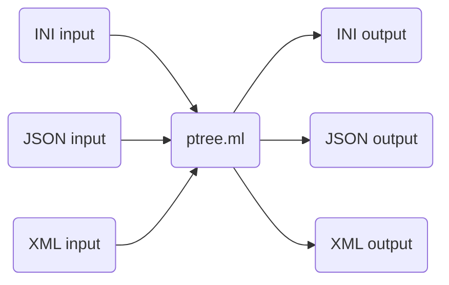

# ptree.ml

_For documentation, see [here](https://www.brandongong.org/ptree.ml/ptree/Ptree/index.html)_.



ptree.ml is a "universal adaptor" between the extraordinarily popular data
serialization formats INI, JSON, and XML for OCaml. It provides support for
parsing any of these formats into a unified data structure, making edits /
adding new data, and then exporting data back out to any of those file formats.

As such, it can be used as
- a single, familiar tool to parse multiple file formats (no need to learn a new
  API every time);
- a tool to convert between different file formats (e.g. read in an INI file,
  write it out as JSON);
- a way to easily serialize any data you have (not just modifying pre-existing
  data from another file – you can easily build up your own tree from scratch
  and write it to whatever format you like).

(The name is a nod to C++'s
[Boost.PropertyTree](https://www.boost.org/doc/libs/1_65_1/doc/html/property_tree.html),
which inspired this project.)

## Some more background
The problem of _serializing_ data – that is, converting some abstract object in
a program's memory into a format that can be easily saved in a file or
transmitted – is almost as old as computers themselves. As such, over the
decades many different formats have emerged (INI being a particularly early
format, XML bringing more flexibility at the cost of more complexity and
verbosity, JSON being kind of a middle ground between the two). These formats
still remain pervasive today: INI is used by many Windows programs, and a
similar format is used in `.conf` files on Unix systems; XML is hugely popular
and used by projects such as React Native and Maven; JSON is almost ubiquitous
as a communication format between servers and browsers, as well as being a
general-purpose storage format just as flexible as XML.

Here's a small sample of the same data shown in INI, then XML, then JSON.
```ini
[person]
name = Brandon Gong
is_cool = true
favorite_number = 3.1415
```
```xml
<person>
  <name>Brandon Gong</name>
  <is_cool>true</is_cool>
  <favorite_number>3.1415</favorite_number>
</person>
```
```json
{
  "person": {
    "name": "Brandon Gong",
    "is_cool": true,
    "favorite_number": 3.1415
  }
}
```
Although the three formats appear very different, at heart what they are all
doing is the same: structuring different properties about a certain thing into
a tree, with different categories and subcategories storing various information.

Thus, it makes sense to be able to parse (or _deserialize_) all three of these
file formats into ultimately the same data structure: a _property tree_. It also
makes sense that, given a property tree, we can always turn it back into XML or
JSON; the information is still the same, just some syntactic details have
changed.

This is the central idea behind this library.

ptree.ml views the property tree as a file system, i.e. a set of different
folders (the categories) that can contain files (the properties) or other
folders nested within them. If you're familiar with the Unix/Linux terminal, the
API will be very intuitive to use; much like working in the terminal, you'll be
able to navigate throughout the tree with `cd`, delete properties with `rm`,
rename properties with `mv`, and more.

This intuitive, context-aware editing flow is accomplished all in a pure
functional manner using a Zipper data structure. Thus, editing ptrees is fast,
efficient, and thread-safe.

## Examples

### Example 1: Reading in INI, writing out XML
Suppose we have the given INI file, storing some information about assorted
vegetables:

File `veggies.ini`
```ini
; Comments are supported too!
nutritious = true
tasty = false

[Broccoli]
color = green
calories = 31
protein = 2.5

[Eggplant]
color = purple
calories = 20
protein = 1.
```
and we want to get rid of the `Eggplant` category, and change `Broccoli` color
to `pink`. Finally, we want to write out as XML instead of INI. Here is how we
would accomplish that with `ptree.ml`:

```ocaml
open Ptree

let () = peditor_of_file "path/to/veggies.ini" (* parse the INI file *)
  |> rm_path ["Eggplant"] (* Delete the eggplant folder *)
  |> fst (* rm returns the new peditor and the deleted subtree, which we don't care about *)
  |> cd ["Broccoli" ; "color"] (* cd into color folder *)
  |> put (String "pink") (* put "pink" there, overwriting "green" *)
  |> xml_of_peditor "veggies" (* Done with edits, so turn it into an XML string with base tag name veggies *)
  |> print_string (* print it out *)
```
which outputs:
```xml
<veggies>
  <Broccoli>
    <calories>
      31
    </calories>
    <color>
      pink
    </color>
    <protein>
      2.500000
    </protein>
  </Broccoli>
  <nutritious>
    true
  </nutritious>
  <tasty>
    false
  </tasty>
</veggies>
```

### Example 2: Building up a `ptree` from scratch, writing out to JSON

Suppose we have a data type storing information about authors:

```ocaml
type author = {
  name: string;
  age: int;
  famous_book: string;
}
```

and we have a list of these `authors` we wish to serialize into JSON:

```ocaml
let authors = [
  {name = "J. K. Rowling" ; age = 57 ; famous_book = "Harry Potter"};
  {name = "Yann Martel" ; age = 59 ; famous_book = "Life of Pi"};
  {name = "Zora Neale Hurston" ; age = 131 ; famous_book = "Their Eyes Were Watching God"};
]
```

Here's how we might go about doing this:
```ocaml
open Ptree

let () =
  let serialize_author a = empty
    |> put_path (String a.name) ["name"]
    |> put_path (Int (Int64.of_int a.age)) ["age"] (* Have to cast to Int64 *)
    |> put_path (String a.famous_book) ["famous_book"]
    |> cat in
  let serialized_elts = List.map serialize_author authors in
  let serialized = Array (Array.of_list serialized_elts) in
  empty
    |> put_path serialized ["authors"]
    |> file_of_peditor "authors.json"
```

which outputs into a file named `authors.json` with contents:

```json
{
  "authors": [
    {
      "age": 57,
      "famous_book": "Harry Potter",
      "name": "J. K. Rowling"
    },
    {
      "age": 59,
      "famous_book": "Life of Pi",
      "name": "Yann Martel"
    },
    {
      "age": 131,
      "famous_book": "Their Eyes Were Watching God",
      "name": "Zora Neale Hurston"
    }
  ]
}
```

## Caveats

This library is not yet published to OPAM, as it is not in the production-ready
state that I believe it should be in before I let other people trust and rely
on it:
- The parser library is implemented from scratch, and is perhaps not the most
  efficient. It has not been tested on very large files.
- The parsers for JSON and XML are not exactly down-to-spec (JSON is pretty
  close, XML still needs work). Implementing the (incredibly lengthy) spec
  perfectly was never my main goal with this project, I was more focused on
  learning.
- Generally, more unit testing needs to be done, checking more edge cases just
  to be more confident everything works correctly.
